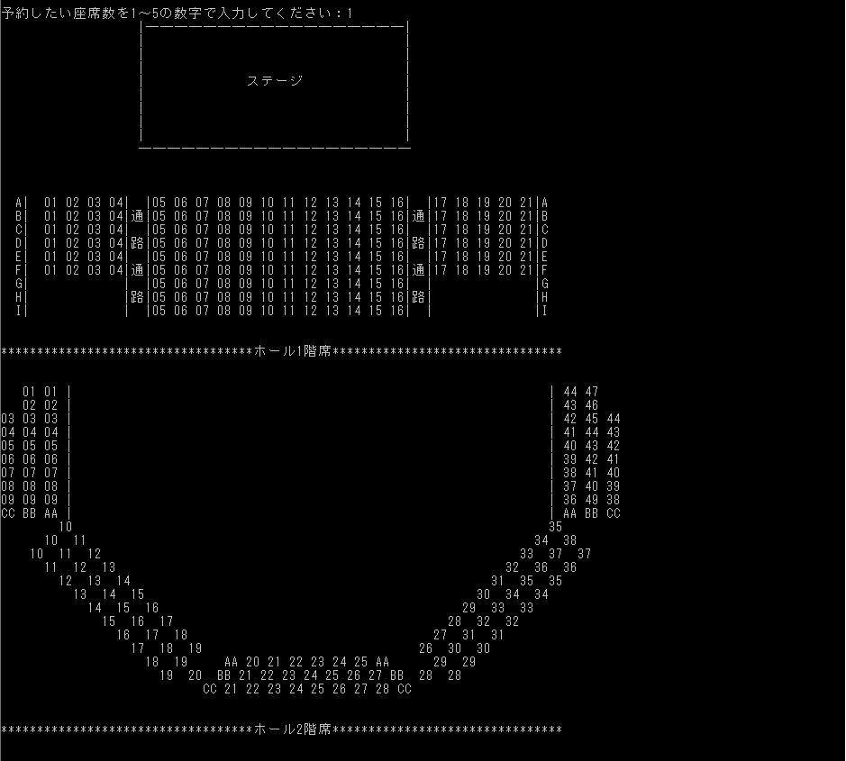
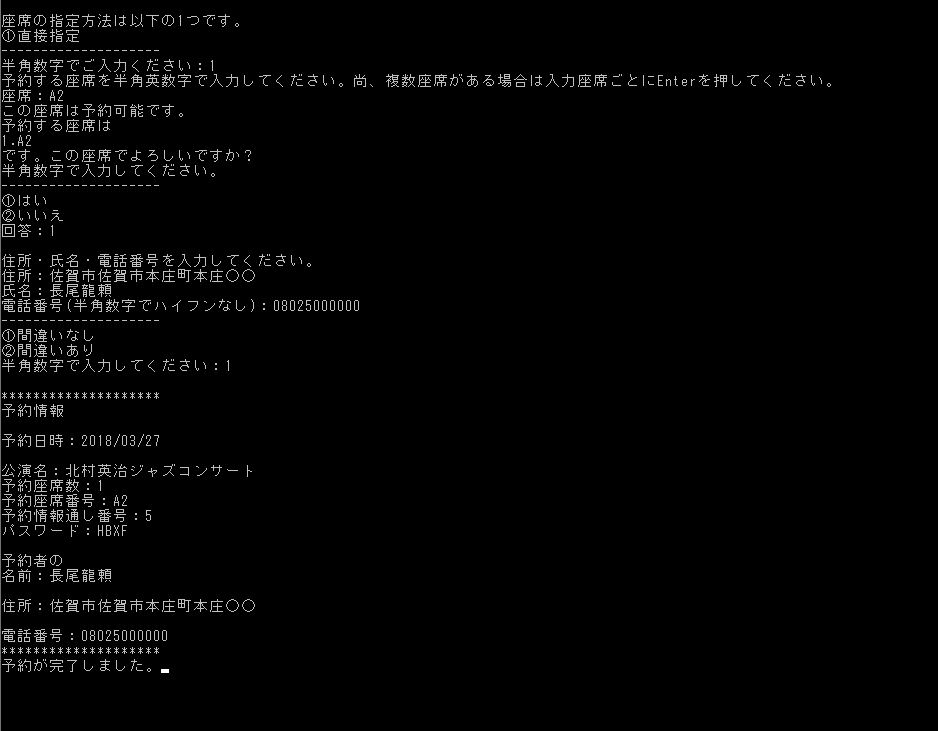
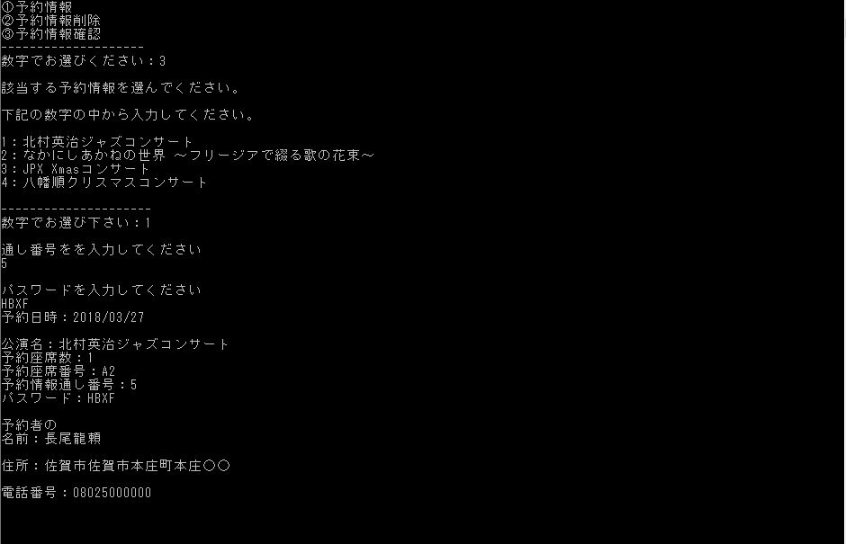

## ドキュメント

+ プログラムの概要(目的や背景などを含める)
  + 目的：ザ・フェニックスホールという実際に存在する演劇ホールの座席予約システムを作成するのが目的
  + 背景：短期大学時代にプログラミングに関する科目内で、これまでのアルゴリズム実装てきな単一的な課題ではなく、より実践的で実用的な制作物を作成するためのプログラミングを行うために、現実に存在するものを対象とした課題を提示されたのが背景である。誤解が発生しないように念のため述べておくが、決して委託されて作っていたわけではない。そして作業は主にペアプログラミングで行う事が義務付けられており、教授をクライアントとして、クライアントからは、「ザ・フェニックスホールの座席予約システムを作って欲しい」とだけ言われている、というような状況下であった。したがって、座席予約システムの体裁さえ成していれば、どのような操作方法であろうと、どんな機能が追加されていようと要件を満たしているという状況であった。

+ 使用言語、フレームワーク
  + C言語を使用。フレームワークはなし

+ プログラムを実行しなくとも動作が理解できる画像のキャプチャ画像など
  + ①予約情報を選択した場合

  + ②予約情報削除を選択した場合

  + ③予約情報確認を選択した場合

+ 起動方法、操作方法
  + 起動方法
    1. GUIの場合は、exeファイルをダブルクリック
    2. CUIの場合は、./exeファイルをターミナルで実行
    3. complete.exeをクリック

  + 操作方法
    1. ①予約情報か②予約情報削除か③予約情報確認かを選ぶ

    2. ①を選択した場合

      1. 予約したい演目を選ぶ

      2. 予約したい座席数を選択

      3. ①直接指定を選択

      4. 予約したい座席を直接指定する

      5. 予約したい座席が合っていれば、①を、間違っていれば②を選択

        1. ①を選択した場合

          1. 個人情報を入力

            1. 入力した個人情報が合っていれば、①を、間違っていれば②を選択

              1. ①を選択した場合

                1. 予約完了(表示される通し番号とパスワードは覚えておく事)

              2. ②を選択した場合

                1. 5.1.1に戻る

        2. ②を選択した場合

          1. 2.3に戻る

    3. ②を選択した場合

      1. 予約した演目を選択

      2. 通し番号を入力

      3. パスワードを入力

      4. 通し番号とパスワードが存在しているかどうか

        1. 存在している場合は削除完了

        2. 存在していなければ3.1に戻る

    4. ③を選択した場合

      1. 予約した演目を選択

      2. 通し番号を入力

      3. パスワードを入力

      4. 通し番号とパスワードが存在しているかどうか

        1. 存在している場合は該当予約情報を表示

        2. 存在していなければ4.1に戻る

      5. 演目変更を行いたい場合

          1. reservation_infomationフォルダ内に追加or削除したい演目名のフォルダを追加or削除する

          2. configrationフォルダ内のconcert_program.txtに"/追加or削除したい演目名/"を追加or削除

      6. ※月に一回はconfigurationフォルダ内のzaseki_info.txtの中身を空にする(通し番号が4桁制限だから)

+ ソースコードの解説
  + ほぼ全ての行にコメントを入れているので、ここでは、関数の説明のみ行う事とする。
    1. pro_sel:予約する公演と座席数の指定
    2. input_res:予約者情報の入力
    3. output_res:予約者情報を画面とファイルに出力
    4. GetRandom:乱数生成
    5. book_app:予約座席と通し番号のファイル出力
    6. AddItem:引数のlistpointerにもう一つの引数のdataを追加
    7. SearchItem:引数のlistpointer内のデータと、もう一つの引数の*data内のデータ比較
    8. res_pass_input:予約情報の削除・確認に使う通し番号、パスワードの入力と、それらを用いた検索ファイル名の作成
    9. Clear:個別の予約者情報ファイルの削除
    10. Confirmation:個別の予約者情報の確認
    11. situation:ホールの座席配置図
    12. direct_sel:座席の直接指定
    13. seat_sel:予約方式指定と予約しようとしている座席の確認
    14. strchg:文字列置換

+ 必要なライブラリ、ランタイム、環境
  + 必要なライブラリ、ランタイム
    1. 標準Cライブラリ
    2. 新規作成ディレクトリ&ファイル群
      1. configrationディレクトリ
        1. concert_program.txt(予約可能な演目名が入っている)
        2. seat_list.txt(予約可能座席が入っている)
        3. zaseki_info.txt(通し番号が入っている)
      2. reservation_infomationディレクトリ
        1. concert_program内に示したそれぞれの演目名の名前のそれぞれのフォルダ
  + 環境
    + WindowsやLinuxなど、Cファイルをコンパイル・ビルドする事ができ、日本語に対応している環境全てにおいて実行可能。

+ コンパイル、ビルド方法
  + gccをインストールし、コンパイルしたいCファイルがある場所まで移動し、「gcc reserve.c」をターミナル上で実行する。

+ 課題や展望
  1. 座席選択を十字キーでGUI的に操作できるようにする
  2. ネットワーク対応を実装し、ユーザそれぞれのコンピュータで、座席予約できるようにする

+ 自己評価、感想
    100点満点中60点と言った所である。理由は、このプログラムは私が初めて、実用的な業務で使えそうなサービスとして、0から作り上げたもので、なおかつ、初めてペアプログラミングで作ったものなので、思いが非常にこもったプログラムとなっている。しかし、授業が終わってから、見てみると、個人の予約ページは削除できているが、予約済み座席一覧から、予約削除された座席が削除されていなかったり、特定の入力値の時にエラーが起きるようなバグが見つかったりもした。さらに言えば、座席が直接指定しかできず、UIに優れているとは到底言えないと考える。
    そして、これを実際に使うとなると、ネットワークの仕組みが組み込めていないが故に、本システムが入っているコンピュータの所まで来ないと予約できないようになっている。したがって、実際の業務で使うには、まだまだ程遠い出来である事は一目瞭然である。したがって大幅な減点は明らかである。ただ、初めての業務システム作成&ペアプログラミング。さらに、貴社へ提出したものは講義後も修正を加えてはいるものの、9割りほどを仕上げた、教授への提出までの期間は、確か3週間に満たないほどの短期間であった。そういった事を鑑みると、このサービスが入っている所までこれば、使い勝手はあまり良くないかもしれないが、正確に予約を行う事ができる事に変わりはない。したがって、及第点としての60点は妥当だと考える。

+ 参考文献、URL
  + 申し訳ございません。忘れてしまいました。

## ファイル構成

### configration > concert_program.txt

+ 予約可能な演目

### configration > seat_list.txt

+ フェニックスホールの座席番号

### configration > zaseki_info.txt

+ 予約情報の通し番号

### reservation_infomation

+ 予約可能な演目に関するフォルダがそれぞれ入る(フォルダ名に半角スペースは使えるが、全角スペースは使えない)

### reservation_infomation > 予約可能な演目のディレクトリ > zaseki.txt

+ 予約済み座席の一覧が入っている

### reservation_infomation > 予約可能な演目のディレクトリ > それぞれの予約された情報が入っているファイル

+ 1回の入力で予約した予約情報が入っている
